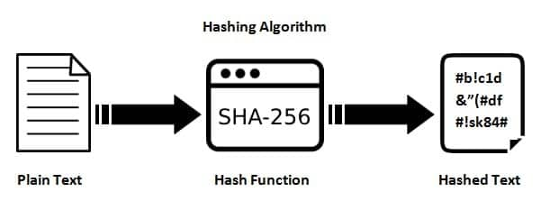
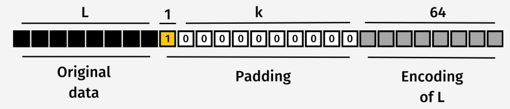

**Reference:** [CheapSSLWeb – What is SHA-256 and How it Works](https://cheapsslweb.com/blog/what-is-sha-256-algorithm-how-it-works/)

for a more 
[Detailed explanation](https://www.youtube.com/watch?v=f9EbD6iY9zI)


## SHA-256 Overview

**SHA-256 (Secure Hash Algorithm 256-bit)** is a cryptographic hash function. It takes **input data of any size** and outputs a **fixed-length 256-bit value** (usually displayed in hexadecimal). This output is often called a **hash** or **digest**, and it acts like a **digital fingerprint** for the data.

Key properties of SHA-256:

* **Collision resistance**: Two different inputs are extremely unlikely to produce the same hash.
* **Preimage resistance**: Given a hash, it’s practically impossible to reverse-engineer the original input.
* **Deterministic**: The same input always produces the same hash.

These features make SHA-256 ideal for **verifying data integrity**, securing passwords (though with additional techniques like PBKDF2), digital signatures, and other cryptographic protocols.

---

## How SHA-256 Works (Step by Step)

SHA-256 processes input in **512-bit blocks**, performing a sequence of operations to generate the final 256-bit hash.


---

### 1. Data Preprocessing (Padding)

Before processing, the input must be a multiple of **512 bits**.

**Steps:**

1. Append a single `1` bit to the message.
2. Append enough `0` bits to make the total length **64 bits short of a multiple of 512**.
3. Append a 64-bit representation of the **original message length** at the end.

**Why?**
This ensures that the data can be divided into **fixed-size blocks**, which is required for the next stages of hashing. Think of it as **cutting raw material into standard-sized blocks** before manufacturing.



---

### 2. Message Expansion

Each 512-bit block is first split into **16 words of 32 bits**.

Then, these 16 words are **expanded into 64 words** using **logical operations** (shifts, rotations, XORs).

Why?
This process mixes the input bits and ensures that **each bit of the original message influences many bits of the hash**, providing **diffusion** — a key property in cryptography.

---

### 3. Message Compression (64 Rounds)

Each 512-bit block (now expanded to 64 words) goes through **64 rounds of computation**.

**In each round:**

1. **Round constant** – A unique 32-bit number for this round, which introduces extra complexity.
2. **Message schedule value** – Combines the current word with previous words to feed the round.
3. **Working variable update** – Eight 32-bit variables (labeled a–h) are updated using bitwise operations and modular additions.

**Why?**
This step ensures that **even a single-bit change in the input produces a completely different hash**, a property called **avalanche effect**.


---

### 4. Final Hash Computation

After 64 rounds, the **eight working variables** are combined to form the **final 256-bit hash**.

**Why?**
This final output is the **unique fingerprint of the original input**, which is **irreversible** and suitable for verifying data integrity or storing secure digests.

### 5. Why SHA-256 Alone is Not Enough for Password Security

Although SHA-256 is **cryptographically strong** for data integrity and digital signatures, it **is not ideal for password storage** by itself. This is because:

* **Fast hashing** – SHA-256 can compute billions of hashes per second on modern hardware. This makes **brute-force and dictionary attacks feasible** against weak passwords.
* **No built-in salt** – Without a unique salt per password, attackers can use **precomputed tables (rainbow tables)** to reverse common passwords.
* **Vulnerable to length extension attacks** – Certain constructions using SHA-256 (like naïve MACs) can be exploited.

  * Reference: [Hash Extension Attack – YouTube](https://www.youtube.com/watch?v=03quPNadUzY)

**Example**: If an attacker gets your SHA-256 hashed password database, they can try **millions of password guesses per second**, which can crack weak passwords very quickly.

Perfect — let’s really dig deep into **PBKDF2WithHmacSHA256** so it’s more than just a surface-level mention. I’ll walk you through what it is, *why* it exists, *how* it works step by step, and how it improves on SHA-256 alone.

---

# PBKDF2WithHmacSHA256

---

## 1. Why Do We Need PBKDF2?

When we store passwords, simply applying **SHA-256(password)** is unsafe because:

* **Too fast** → Modern CPUs/GPUs can compute billions of SHA-256 hashes per second. This makes brute-force guessing attacks feasible.
* **No salt** → If two users choose the same password, the hashes will be identical. Attackers can also use **rainbow tables** (precomputed hash dictionaries).
* **Vulnerable constructions** → Directly hashing with SHA-256 doesn’t prevent certain cryptographic attacks, like length extension.

So we need a **password hashing strategy** that is:

* **Slow** → To resist brute-force.
* **Unique** → Even identical passwords hash differently.
* **Cryptographically sound** → Resistant to known attacks.

---

## 2. What is PBKDF2?

**PBKDF2** = *Password-Based Key Derivation Function 2*.

It is defined in [RFC 8018](https://www.rfc-editor.org/rfc/rfc8018).
Its purpose: take a password and make it into a **cryptographically strong key** that is expensive to guess.

It does this by combining:

1. **A password** (e.g., `"MySuperSecret123"`).
2. **A salt** (random bytes unique per password).
3. **An iteration count** (e.g., 100,000).
4. **A pseudorandom function (PRF)** — in our case, `HMAC-SHA256`.

---

## 3. Why HMAC-SHA256?

HMAC (Hash-based Message Authentication Code) is used instead of plain SHA-256 because:

* It turns SHA-256 into a **keyed hash function**.
* It **removes vulnerabilities** like length extension.
* It provides stronger **cryptographic mixing** of the password and salt.

So, **PBKDF2WithHmacSHA256** = PBKDF2 that uses HMAC-SHA256 as its PRF.

[How hmac works](https://www.youtube.com/watch?v=MKn3cxFNN1I)

---

## 4. How PBKDF2WithHmacSHA256 Works (Step by Step)

Let’s break it down:

### Step 1: Input

* Password: `"hunter2"`
* Salt: `random 16 bytes` (e.g., `0x1f2a3b...`)
* Iterations: `100,000`
* Output key length: `32 bytes (256 bits)`

---

### Step 2: HMAC Function

PBKDF2 calls `HMAC-SHA256(password, salt || blockIndex)`.

* `blockIndex` is a counter (1, 2, 3, …) used to generate enough key material.
* Each call produces 32 bytes.

---

### Step 3: Iterations (Stretching)

Instead of using just one HMAC call, PBKDF2 **repeats it many times**:

```
U1 = HMAC(password, salt || blockIndex)
U2 = HMAC(password, U1)
U3 = HMAC(password, U2)
...
Uc = HMAC(password, U(c-1))   // after c iterations
```

Then PBKDF2 **XORs** all these results together:

```
F = U1 ⊕ U2 ⊕ U3 ⊕ ... ⊕ Uc
```

That final `F` is the derived key block for this `blockIndex`.

---

### Step 4: Multiple Blocks

If you need more than 32 bytes (e.g., a 64-byte key), PBKDF2 just repeats the above process with `blockIndex = 2, 3, ...`.

---

### Step 5: Output

The concatenated blocks form the final derived key, e.g.:

```
0x9f2b...d7c4e8
```

---

## 5. Why is This Secure?

* **Salt** → Prevents rainbow table attacks. Each password is hashed uniquely.
* **Iterations** → Slows down brute force. If SHA-256 can do 1 billion hashes/sec, then 100,000 iterations reduces this to \~10,000 guesses/sec.
* **HMAC** → Strong PRF that removes weaknesses of plain SHA-256.
* **Deterministic** → Same password + salt + iterations always gives the same derived key (important for verification).

---

## 6. Real Example

Suppose a user picks the password `"password123"`.

* Salt = `0xAB12F4...`
* Iterations = `100,000`
* PBKDF2WithHmacSHA256 outputs:

```
c83c0f65e5f6d31f39df98cd...   (64 hex chars = 32 bytes)
```

If the attacker tries to brute-force, they need to run **100,000 SHA-256 operations per guess**. That makes cracking even weak passwords significantly harder.

---

## 7. Why Not Just SHA-256?

Without PBKDF2:

* `"password123"` → SHA-256 →
  `ef92b778...e4a938d4c`

An attacker can check billions of these per second using GPU clusters.

With PBKDF2 (100k iterations):

* `"password123"` → PBKDF2WithHmacSHA256 →
  `c83c0f65...`

Now every guess costs **100,000 HMAC-SHA256 ops**, making large-scale brute force infeasible.

