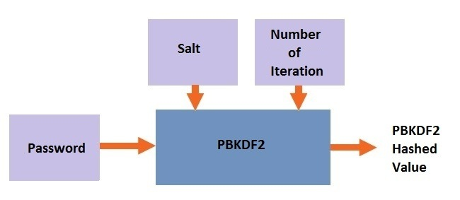
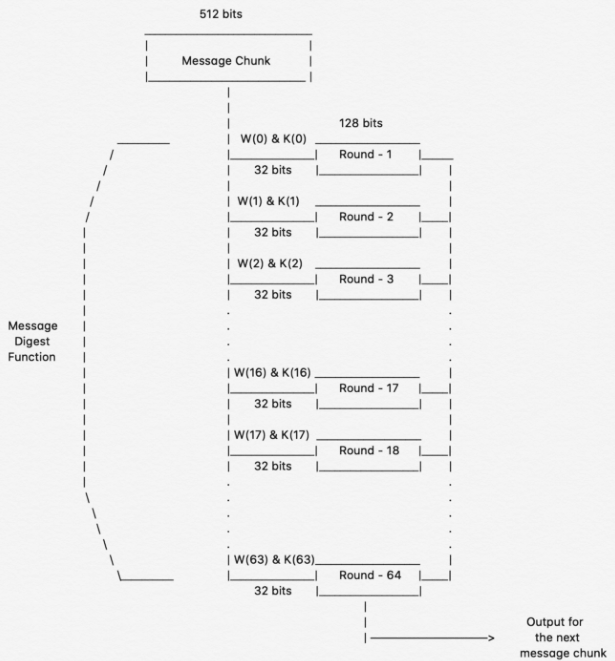
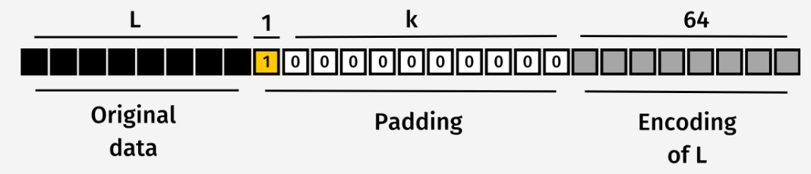

**Reference:** [CheapSSLWeb – What is SHA-256 and How it Works](https://cheapsslweb.com/blog/what-is-sha-256-algorithm-how-it-works/)
Here’s a clear and polished rewording of your “How it Works” section:

**SHA-256 (Secure Hash Algorithm 256-bit)** is a cryptographic hash function that takes an input of any length and produces a fixed-length 256-bit output, typically represented in hexadecimal form.

The algorithm works in several stages: the input message is first padded, then constants are initialized, and finally a series of rounds of arithmetic and logical operations are applied. The final output is a **hash value** — a unique digital fingerprint of the input.

SHA-256 is widely valued in cryptography because of its strong resistance to attacks:

* **Collision resistance**: It is extremely unlikely for two different inputs to produce the same hash.
* **Preimage resistance**: Given a hash, it is practically impossible to deduce the original input. (it is irreversible)

These properties make SHA-256 ideal for ensuring **data integrity and authenticity** in various security applications. It is commonly used in cryptographic protocols, digital signatures, certificate authorities, and data verification systems.

The function’s combination of robustness and efficiency has made SHA-256 a cornerstone of modern cryptography, providing a reliable foundation for secure data handling and verification.

---

## How SHA-256 Works

### 1. Data Preprocessing

The input message is first **padded** to make its length a multiple of 512 bits.

* Padding begins with a single `1` bit, followed by enough `0` bits to reach the required length.
* Finally, the **original message length (in bits)** is appended at the end.

This ensures that the message can be processed in fixed-size 512-bit blocks.

---

### 2. Message Expansion

Each 512-bit block is initially divided into **16 words of 32 bits each**.

* These 16 words are then **expanded into 64 words** through a sequence of logical operations, creating a message schedule for the next stage.

---

### 3. Message Compression

The expanded 64-word message block is processed through **64 rounds of hashing**. Each round includes:

1. **Round constants** – Every round uses a unique 32-bit constant that influences the calculations.
2. **Message schedule calculation** – Combines the expanded words and round constants to produce inputs for the current round.
3. **Working variable updates** – Eight 32-bit variables hold intermediate values and are updated each round using bitwise operations and modular additions.

---

### 4. Hash Value Calculation

After all 64 rounds are completed, the **final hash value** is computed by combining the eight working variables.

* This 256-bit output represents a **unique fingerprint of the original input**, completing the SHA-256 hashing process.
---
---
---
---
---
---
---
---
---
---

**Reference:** [CheapSSLWeb – What is SHA-256 and How it Works](https://cheapsslweb.com/blog/what-is-sha-256-algorithm-how-it-works/)

---

## SHA-256 Overview

**SHA-256 (Secure Hash Algorithm 256-bit)** is a cryptographic hash function. It takes **input data of any size** and outputs a **fixed-length 256-bit value** (usually displayed in hexadecimal). This output is often called a **hash** or **digest**, and it acts like a **digital fingerprint** for the data.

Key properties of SHA-256:

* **Collision resistance**: Two different inputs are extremely unlikely to produce the same hash.
* **Preimage resistance**: Given a hash, it’s practically impossible to reverse-engineer the original input.
* **Deterministic**: The same input always produces the same hash.

These features make SHA-256 ideal for **verifying data integrity**, securing passwords (though with additional techniques like PBKDF2), digital signatures, and other cryptographic protocols.

---

## How SHA-256 Works (Step by Step)

SHA-256 processes input in **512-bit blocks**, performing a sequence of operations to generate the final 256-bit hash.

---

### 1. Data Preprocessing (Padding)

Before processing, the input must be a multiple of **512 bits**.

**Steps:**

1. Append a single `1` bit to the message.
2. Append enough `0` bits to make the total length **64 bits short of a multiple of 512**.
3. Append a 64-bit representation of the **original message length** at the end.

**Why?**
This ensures that the data can be divided into **fixed-size blocks**, which is required for the next stages of hashing. Think of it as **cutting raw material into standard-sized blocks** before manufacturing.

---

### 2. Message Expansion

Each 512-bit block is first split into **16 words of 32 bits**.

Then, these 16 words are **expanded into 64 words** using **logical operations** (shifts, rotations, XORs).

**Why?**
This process mixes the input bits and ensures that **each bit of the original message influences many bits of the hash**, providing **diffusion** — a key property in cryptography.

---

### 3. Message Compression (64 Rounds)

Each 512-bit block (now expanded to 64 words) goes through **64 rounds of computation**.

**In each round:**

1. **Round constant** – A unique 32-bit number for this round, which introduces extra complexity.
2. **Message schedule value** – Combines the current word with previous words to feed the round.
3. **Working variable update** – Eight 32-bit variables (labeled a–h) are updated using bitwise operations and modular additions.

**Why?**
This step ensures that **even a single-bit change in the input produces a completely different hash**, a property called **avalanche effect**.

---

### 4. Final Hash Computation

After 64 rounds, the **eight working variables** are combined to form the **final 256-bit hash**.

**Why?**
This final output is the **unique fingerprint of the original input**, which is **irreversible** and suitable for verifying data integrity or storing secure digests.

---

This version explains **not just what happens**, but also **why each step exists**, which helps readers understand SHA-256 conceptually rather than just mechanically.

---

If you want, I can also **create a visual cheat sheet with arrows showing how input → preprocessing → expansion → compression → final hash** to make this even more tutorial-friendly. Do you want me to do that?
